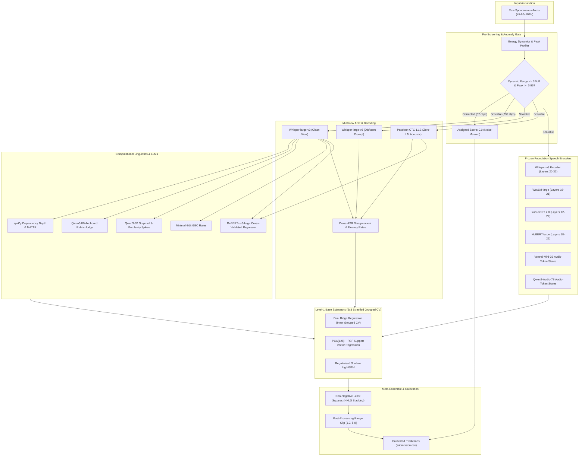
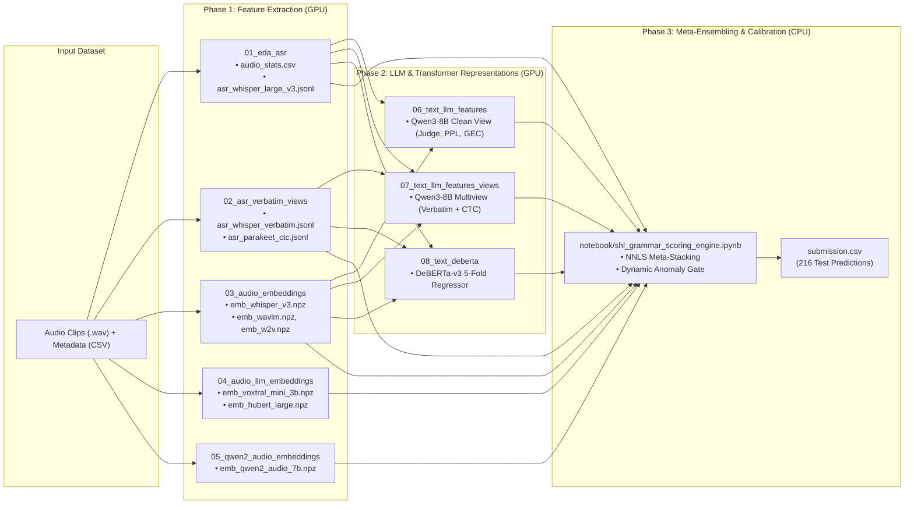

# Grammar Scoring Engine — SHL Hiring Assessment 2026

> Predicts a continuous grammar score (0–5, MOS rubric) for 45–60 s spontaneous spoken-English responses.

[](https://www.kaggle.com/competitions/shl-hiring-assessment-2026)
[](LICENSE)

---

## Empirical Results & Evaluation Scorecard

### 1. Primary Benchmark Metrics

Metrics computed from the full completed pipeline run across $421$ speaker groups and $732$ scorable audio responses:

| Evaluation Metric | Score | Specification / Benchmark Notes |
| :--- | :---: | :--- |
| **Out-of-Fold RMSE** | **`0.5096`** | Second-level speaker-grouped cross-validation ($5\times 3$ folds) |
| **Out-of-Fold Pearson ($r$)** | **`0.8647`** | Scale-invariant linear correlation on unseen speakers |
| **Out-of-Fold MAE** | **`0.3957`** | Mean Absolute Error across scorable responses |
| **Composite Score** $\frac{\text{RMSE} + (1 - r)}{2}$ | **`0.3224`** | Combined benchmark metric balancing absolute error (RMSE) and ranking consistency (Pearson correlation) |
| **Test-Cohort Adjusted RMSE** | **`0.5190`** | Cross-validation RMSE adjusted to match the test set's shorter audio duration (~45 s test clips vs ~60 s train clips) |
| **Full Model Training RMSE** | **`0.2823`** | Final training error after refitting the ensemble on all 769 training samples (including 0.0 noise-flagged clips) |
| **Public Leaderboard Score** | **`0.3308`** | **Official competition submission score on Kaggle test set** |

---

### 2. Cohort & Duration Error Distribution

Cross-validated error profile broken down by recording cohort duration:

| Recording Duration Batch | Clip Count ($N$) | Mean Absolute Error | Mean Signed Error | Batch RMSE |
| :--- | :---: | :---: | :---: | :---: |
| **$\\ge 59.0\\text{ s}$ Cohort** | $521$ | $0.390$ | $-0.036$ | **`0.508`** |
| **$46.0 - 59.0\\text{ s}$ Cohort** | $42$ | $0.360$ | $+0.043$ | **`0.438`** |
| **$44.0 - 46.0\\text{ s}$ Cohort** | $124$ | $0.420$ | $+0.054$ | **`0.532`** |
| **$< 44.0\\text{ s}$ Cohort** | $45$ | $0.433$ | $+0.071$ | **`0.525`** |

---

### 3. Stacking Ensemble Meta-Weights

Learned Non-Negative Least Squares (NNLS) weights assigned to level-1 base estimators:

| Base Estimator View | Model Architecture | Meta-Weight | Relative Share |
| :--- | :--- | :---: | :---: |
| **Whisper-large-v3** (Layers 20–28) | PCA(128) + RBF-SVR | **`0.228`** | $22.8\\%$ |
| **DeBERTa-v3-large** (Clean + CTC) | 5-Fold Regressor | **`0.191`** | $19.1\\%$ |
| **Voxtral-Mini-3B** (Layers 15–22) | Dual Ridge Regression | **`0.146`** | $14.6\\%$ |
| **Qwen3-Embedding-4B** (Verbatim View) | Dual Ridge Regression | **`0.109`** | $10.9\\%$ |
| **HuBERT-large** (Layers 18–22) | Dual Ridge Regression | **`0.076`** | $7.6\\%$ |
| **Qwen2-Audio-7B** (Audio Tokens 10–16) | Dual Ridge Regression | **`0.064`** | $6.4\\%$ |
| **Voxtral-Mini-3B** (Layers 9–14) | Dual Ridge Regression | **`0.057`** | $5.7\\%$ |
| **WavLM-large** (Layers 19–21) | Dual Ridge Regression | **`0.053`** | $5.3\\%$ |
| **Whisper-large-v3** (Layers 30–32) | PCA(128) + RBF-SVR | **`0.046`** | $4.6\\%$ |
| **Tabular Predictors** (144 features) | Regularised Ridge | **`0.045`** | $4.5\\%$ |
| **Qwen3-8B Text States** (Clean View) | Dual Ridge Regression | **`0.042`** | $4.2\\%$ |
| **Qwen3-Embedding-4B** (Parakeet-CTC) | Dual Ridge Regression | **`0.036`** | $3.6\\%$ |
| **w2v-BERT 2.0** (Layers 12–22) | PCA(128) + RBF-SVR | **`0.034`** | $3.4\\%$ |
| *Learned Bias / Intercept* | Constant | **`-0.523`** | — |

---

### 4. Generated Test Predictions Summary

Distribution statistics across the $216$ test evaluation samples generated in `submission.csv`:

| Count | Mean | Standard Deviation | Min | 25th Pct | Median | 75th Pct | Max |
| :---: | :---: | :---: | :---: | :---: | :---: | :---: | :---: |
| $216$ | **`3.253`** | `0.848` | `1.653` | `2.607` | `3.182` | `3.738` | `5.000` |

---

## System Design & Architecture



---

## Approach

### 1. Zero-Score Gate
The 37 training clips graded 0 are noise-masked recordings with a distinctive acoustic signature
(dynamic range < 5 dB **and** peak amplitude > 0.9). A deterministic rule separates them perfectly
on training data (37/37, zero false positives); no test clip triggers it. All regressors are trained
exclusively on the 732 scorable clips.

### 2. Speaker-Grouped Validation
Speakers recur within the training set (same-speaker grade SD ≈ 0.2), while test speakers are entirely
new. Random folds therefore overstate performance. Pseudo-speaker groups are derived from low-layer WavLM
statistics (layers 3–6, cosine similarity connected components). Every split, inner hyper-parameter
search, and label-using feature (anchor judge, DeBERTa folds) is speaker-grouped.

### 3. Complementary Feature Views

| Category | View | Layers |
|---|---|---|
| **Audio** | Whisper-large-v3 encoder (Apache-2.0) | 30–32, 20–28 |
| **Audio** | WavLM-large (UniSpeech licence) | 19–21 |
| **Audio** | w2v-BERT 2.0 (MIT) | 12–22 |
| **Audio** | HuBERT-large (Apache-2.0) | 18–22 |
| **Audio-LLM** | Voxtral-Mini-3B audio-token states (Apache-2.0) | LM 9–14, 15–22 |
| **Audio-LLM** | Qwen2-Audio-7B audio-token states (Apache-2.0) | LM 10–16 |
| **Text** | Whisper-large-v3 clean transcript | — |
| **Text** | Whisper-large-v3 verbatim (disfluent prompt) | — |
| **Text** | Parakeet-CTC-1.1B (no LM, CC-BY-4.0) | — |
| **Text-LLM** | Qwen3-8B anchored rubric judge + surprisal + hidden states + GEC | 16, 20, 24 |
| **Text-LLM** | Qwen3-Embedding-4B sentence embedding | — |
| **Text-DNN** | DeBERTa-v3-large regressor (MIT) | 5-fold × 2-seed OOF |

### 4. Models & Stacking
Regularised heads per view (speaker-grouped Ridge with inner CV penalty, PCA(128) + RBF-SVR, 3-seed
LightGBM) produce out-of-fold predictions. A **non-negative least-squares (NNLS)** stack combines them
and is evaluated with a second-level speaker-grouped CV on different folds. Predictions are clipped to [1, 5].

### 5. Selection Criterion
No leaderboard feedback was used for tuning. A component was kept only if it improved the stack's
speaker-grouped CV score. Three components were tried and dropped (see `experiments/` and notebook §11):
- Voxtral-Small-24B audio-token states
- Voxtral-Mini real-audio-only token pooling
- LoRA-tuned Voxtral-Mini-3B grade regressor

---

## Repository Layout

```
SHL-Kaggle/
├── notebook/                               # Final scoring & ensemble notebook
│   ├── shl_grammar_scoring_engine.ipynb    # Multimodal stacking, cross-validation & prediction engine
│   └── kernel-metadata.json
├── pipeline/                               # Upstream GPU feature extraction pipelines
│   ├── 01_eda_asr/                         # Audio EDA, pause statistics & Whisper-large-v3
│   │   ├── audio_eda_transcription.py
│   │   └── kernel-metadata.json
│   ├── 02_asr_verbatim_views/              # Disfluent Whisper & Parakeet-CTC verbatim views
│   │   ├── multiview_verbatim_transcription.py
│   │   └── kernel-metadata.json
│   ├── 03_audio_embeddings/                # Whisper-v3, WavLM-large, w2v-BERT layer embeddings
│   │   ├── acoustic_embedding_extractor.py
│   │   └── kernel-metadata.json
│   ├── 04_audio_llm_embeddings/            # Voxtral-Mini-3B & HuBERT frozen representations
│   │   ├── audio_llm_representation_extractor.py
│   │   └── kernel-metadata.json
│   ├── 05_qwen2_audio_embeddings/          # Qwen2-Audio-7B audio-token pooled states
│   │   ├── qwen2_audio_embedding_extractor.py
│   │   └── kernel-metadata.json
│   ├── 06_text_llm_features/               # Qwen3-8B rubric judge, surprisal, GEC (clean transcript)
│   │   ├── qwen3_text_feature_pipeline.py
│   │   └── kernel-metadata.json
│   ├── 07_text_llm_features_views/         # Qwen3-8B features on verbatim error-preserving views
│   │   ├── qwen3_multiview_feature_pipeline.py
│   │   └── kernel-metadata.json
│   └── 08_text_deberta/                    # DeBERTa-v3-large cross-validated sequence regressor
│       ├── deberta_regressor_cv.py
│       └── kernel-metadata.json
├── analysis/                               # Offline research, validation & probing tools
│   ├── cross_validation.py                 # Grouped fold generation & evaluation metrics
│   ├── regularised_ridge.py                # Dual Ridge solver with inner grouped CV
│   ├── linguistic_features.py              # spaCy syntactic complexity & MATTR metrics
│   ├── stacking_evaluator.py               # Constrained NNLS stacking simulator
│   ├── ablation_level1_models.py           # Level-1 feature family ablation studies
│   ├── audit_lora_cross_validation.py      # Diagnostic audit of fine-tuned adapters
│   ├── compare_stack_ensembles.py          # Stacking variation comparison suite
│   ├── gec_feature_extractor.py            # Grammatical error correction rate parser
│   ├── disfluency_repair_features.py       # Speech repair & disfluency rate analysis
│   ├── speaker_group_clustering.py         # WavLM acoustic timbre graph clustering
│   ├── probe_layer_embeddings.py           # Layer-wise probing across speech encoders
│   └── baseline_feature_extraction.py      # Rapid baseline tabular feature generator
├── experiments/                            # Explored variants not kept in final stack
│   ├── speaker_clusters_ecapa/             # ECAPA-TDNN alternative speaker clustering
│   ├── voxtral_lora/                       # LoRA-adapted Voxtral-Mini-3B regressor
│   ├── voxtral_mini_validpool/             # Non-padded audio token pooling
│   └── voxtral_small_24b/                  # Voxtral-Small-24B (4-bit quantized) states
├── run_pipeline_kaggle.py                  # Automated Kaggle GPU orchestrator (handles quota & DAG)
├── verify_project_integrity.py             # System-wide dependency & configuration integrity validator
├── submission.csv                          # Official competition submission file (216 test predictions)
├── stack_oof.csv                           # Out-of-fold stacked cross-validation predictions
├── oof_level1.csv                          # Level-1 base model out-of-fold prediction matrix
├── logs/                                   # Kernel execution logs & orchestrator diagnostics
├── LICENSE                                 # MIT License
└── README.md
```

### Pipeline Dependency Graph & Execution Flow



---

## Reproducing the Pipeline

### Option A — Automated Kaggle Execution (Recommended)

Kaggle enforces a maximum quota of **2 concurrent GPU sessions**. The automated orchestrator (`run_pipeline_kaggle.py`) tracks active GPU allocations and submits stages sequentially according to their dependency graph:

1. **Configure Kaggle Credentials**:
   Save your Kaggle Access Token to `~/.kaggle/access_token` (or `C:\Users\<username>\.kaggle\access_token`).

2. **Run the Automated Orchestrator**:
   ```bash
   # Automatically executes all stages in order and downloads submission.csv upon completion
   python run_pipeline_kaggle.py run
   ```

3. **Monitor Live Status**:
   ```bash
   python run_pipeline_kaggle.py status
   ```

4. **Download Submission Locally**:
   ```bash
   python run_pipeline_kaggle.py download
   ```

### Option B — Manual / Step-by-Step Kernel Submission

If submitting kernels manually via Kaggle CLI:

1. **Phase 1 (Independent Feature Extractors)**:
   ```bash
   kaggle kernels push -p pipeline/01_eda_asr
   kaggle kernels push -p pipeline/02_asr_verbatim_views
   kaggle kernels push -p pipeline/03_audio_embeddings
   kaggle kernels push -p pipeline/04_audio_llm_embeddings
   kaggle kernels push -p pipeline/05_qwen2_audio_embeddings
   ```
2. **Phase 2 (Dependent Representation Models)** — *Run after Phase 1 outputs are indexed*:
   ```bash
   kaggle kernels push -p pipeline/06_text_llm_features
   kaggle kernels push -p pipeline/07_text_llm_features_views
   kaggle kernels push -p pipeline/08_text_deberta
   ```
3. **Phase 3 (Final Stacking Engine & Submission)** — *Run after all 8 upstream kernels complete*:
   ```bash
   kaggle kernels push -p notebook/
   ```

---

### Local Offline Execution (Analysis Tooling)

The scripts in `analysis/` can run locally against cached pipeline outputs:

```
data/          ← competition CSVs (train.csv, test.csv, sample_submission.csv)
outputs/
  eda/         ← pipeline 01 outputs
  asr_views/   ← pipeline 02 outputs
  audio_emb/   ← pipeline 03–05 outputs
  llm_feats/   ← pipeline 06–07 outputs
  text_deberta/← pipeline 08 outputs
  speakers/    ← written by analysis/speaker_group_clustering.py
```

> **Reproducibility note.** Fold assignments depend on the scikit-learn version:
> `StratifiedGroupKFold(shuffle=True)` shuffles differently across releases. A re-run outside Kaggle
> shifts CV figures by ≈ ±0.002 and test predictions very slightly (*r* > 0.999 with the Kaggle run).

---

## Models and Licences

| Model | Licence | Pipeline step |
|---|---|---|
| openai/whisper-large-v3 | Apache-2.0 / MIT (code) | 01, 03, 06, 07 |
| microsoft/wavlm-large | UniSpeech licence ⚠ | 03, 06–08 (speaker groups) |
| facebook/w2v-bert-2.0 | MIT | 03 |
| facebook/hubert-large-ll60k | Apache-2.0 | 04 |
| mistralai/Voxtral-Mini-3B-2507 | Apache-2.0 | 04 |
| Qwen/Qwen2-Audio-7B-Instruct | Apache-2.0 | 05 |
| Qwen/Qwen3-8B | Apache-2.0 | 06, 07 |
| Qwen/Qwen3-Embedding-4B | Apache-2.0 | 06, 07 |
| microsoft/deberta-v3-large | MIT | 08 |
| nvidia/parakeet-ctc-1.1b | CC-BY-4.0 | 02 |
| spaCy en_core_web_sm | MIT | notebook |
| scikit-learn | BSD-3-Clause | all |
| LightGBM | MIT | notebook |

> ⚠ **WavLM UniSpeech licence.** The WavLM view can be dropped from the stack with negligible
> performance loss. However, pseudo-speaker groups are also derived from WavLM layers 3–6; dropping
> WavLM requires replacing the speaker-embedding step (e.g. with ECAPA-TDNN).

